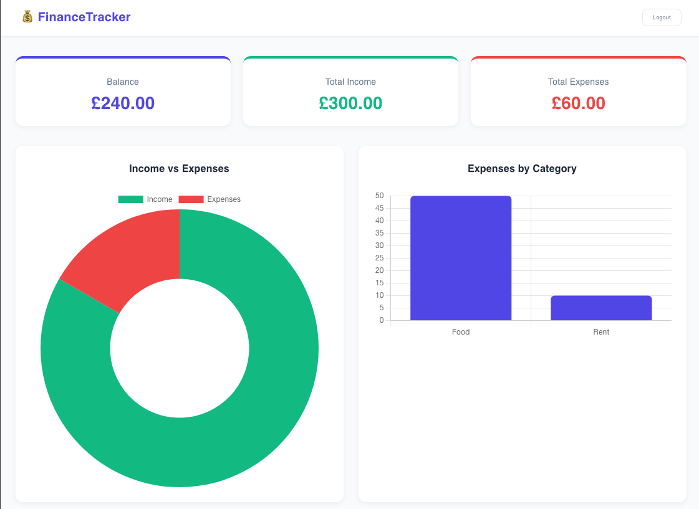

# 💰 Finance Tracker

A full-stack personal finance tracking application built with **FastAPI**, **React**, **PostgreSQL**, and **JWT authentication**.

## ✨ Features

- 🔐 Secure user authentication with JWT tokens
- 💸 Add and delete income & expense transactions
- 📊 Visual charts — income vs expenses and spending by category
- 🏦 Real-time balance, income, and expense summary cards
- 🔒 All routes protected — users only see their own data

## 🛠️ Tech Stack

| Layer | Technology |
|---|---|
| Frontend | React, Vite, Chart.js, React Router |
| Backend | FastAPI, SQLAlchemy, Pydantic |
| Database | PostgreSQL |
| Auth | JWT (PyJWT), bcrypt password hashing |
| API Testing | Postman |

## 🚀 Getting Started

### Backend Setup

    cd backend
    pipenv install
    pipenv run uvicorn app.main:app --reload

API runs at http://localhost:8000  
Swagger docs at http://localhost:8000/docs

### Frontend Setup

    cd frontend
    npm install
    npm run dev

App runs at http://localhost:5173

## 📸 Screenshots

### Login Page

### Dashboard

## 📁 Project Structure

    finance-tracker/
    ├── backend/
    │   └── app/
    │       ├── models/        # SQLAlchemy database models
    │       ├── routes/        # FastAPI route handlers
    │       ├── schemas/       # Pydantic request/response schemas
    │       ├── utils/         # JWT auth and password hashing
    │       ├── database.py    # Database connection
    │       └── main.py        # FastAPI app entry point
    └── frontend/
        └── src/
            ├── api/           # Axios API config
            ├── components/    # Reusable React components
            └── pages/         # Login and Dashboard pages

## 🔌 API Endpoints

| Method | Endpoint | Description | Auth |
|---|---|---|---|
| POST | `/auth/register` | Register new user | ❌ |
| POST | `/auth/login` | Login and get JWT token | ❌ |
| GET | `/transactions/` | Get all user transactions | ✅ |
| POST | `/transactions/` | Create new transaction | ✅ |
| DELETE | `/transactions/{id}` | Delete a transaction | ✅ |